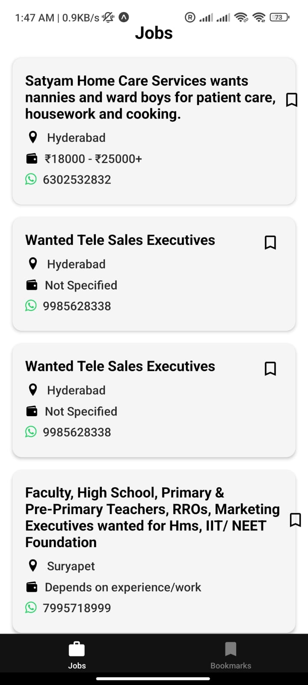
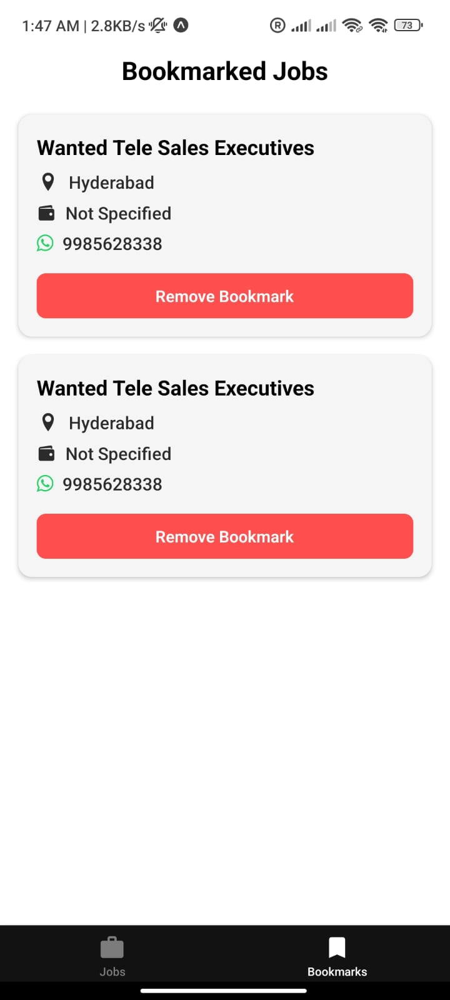

# LOKAL JOB LISTING APP

Welcome to the **LOKAL JOB LISTING APP**! 🚀 This app is designed to help users easily explore job listings and bookmark opportunities for quick access anytime.

---

## 📱 Screenshots

<p align="center">
  
  
  [Watch the Demo](https://drive.google.com/file/d/1R2QTveahlkJlcCAErjgiPqFH8oXBuSU3/view?usp=sharing)
</p>

---

## 🎥 Demo Video

▶️ [Watch the Demo](https://drive.google.com/file/d/1FTYV9b8tFHmcKNRMPIwX50v_SLxrOgRo/view?usp=sharing)
## 🚀 Features

---
- **Job Listings** – Discover various job opportunities effortlessly.  
- **Job Details** – View complete information about each job.  
- **Save Jobs** – Bookmark jobs to revisit them later.  
- **Easy Navigation** – Smooth browsing with an intuitive interface.  

---

## 🛠 Technology Stack

- **Frontend**: Built using React Native with Expo.  
- **State Management**: Utilizes local storage for handling bookmarks.  
- **API Integration**: Fetches job listings from an API: [Job Listings API](https://testapi.getlokalapp.com/common/jobs?page=1).  

---

## 📦 Installation Guide

1. **Clone the repository:**
   ```bash
   git clone https://github.com/dhiraut/LOKAL_APP.git
   cd LOKAL
   ```
2. **Install dependencies:**
   ```bash
   npm install
   ```
3. **Start the application:**
   ```bash
   npx expo start
   ```

---

## 📌 Author & Contact

**Author:** Dhiraj Kumar Raut
